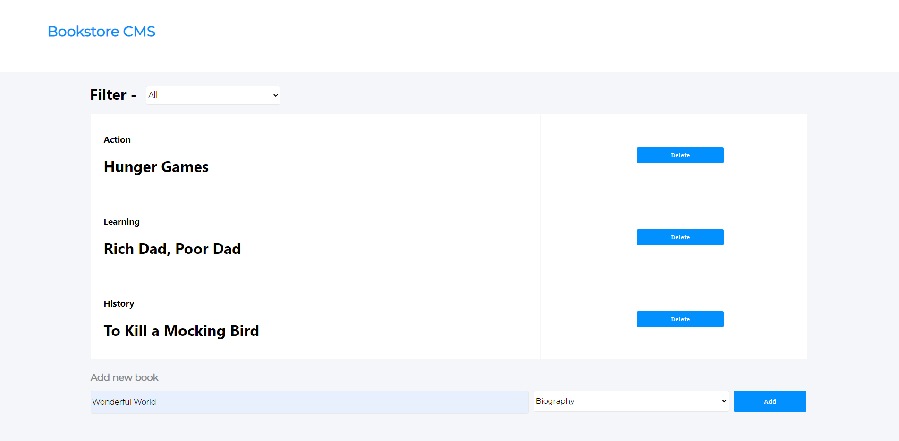

# React Bookstore CMS

> A simple online library of books built with React.Js



Magic-books Inc. is a fictional company based in Germany. They have requested our help to build the front-end of an application that will help them organize and manage their bookstore. They want it to be fast, dynamic and responsive to their actions and therefore we've decided to build it with React & Redux.

## Built With

- JavaScript
- React.Js
- Redux
- React Router
- Bootstrap

## Live Demo

[Live Demo Link](https://leoandahmedbookstore.herokuapp.com/)


## Getting Started

To get a local copy up and running follow these simple example steps.

### Prerequisites

- Node.Js
- Yarn or NPM
- Browser of any choice

### Setup

1. Clone repo ``` git clone https://github.com/mrnadaara/React-Bookstore.git ```
2. Go to repo directory and install npm modules ``` cd React-Bookstore && yarn install ```

### Usage

Start development server ``` yarn start ```

### Deployment

Project was deployed to Heroku using [create-react-app-buildpack](https://github.com/mars/create-react-app-buildpack)

## Authors

👤 **Sharma'arke Ahmed**

- Github: [@mrnadaara](https://github.com/mrnadaara)
- Twitter: [@mrnadaara](https://twitter.com/mrnadaara)
- Linkedin: [Sharma'arke Ahmed](https://www.linkedin.com/in/sharmarke-ahmed/)

👤 **Leonard Rwai Kanyesigye**

- Github: [@rmauritsson](https://github.com/rmauritsson)
- Twitter: [@leokanye](https://twitter.com/leokanye)
- Linkedin: [Leonard Rwai Kanyesigye](https://www.linkedin.com/in/leonard-rwai-kanyesigye/)

## 🤝 Contributing

Contributions, issues and feature requests are welcome!

Feel free to check the [issues page](issues/).

## Show your support

Give a ⭐️ if you like this project!

## Acknowledgments

- [Microverse](https://www.microverse.org/) for providing this project requirements and specifications

## 📝 License

This project is [MIT](lic.url) licensed.
